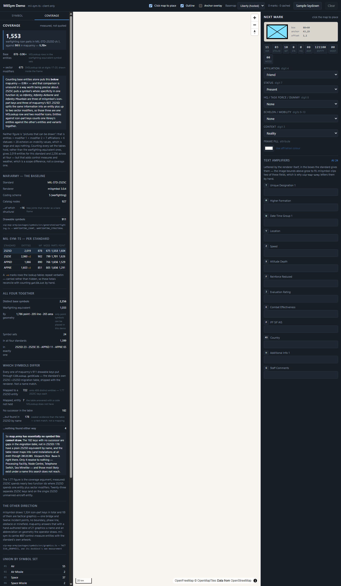
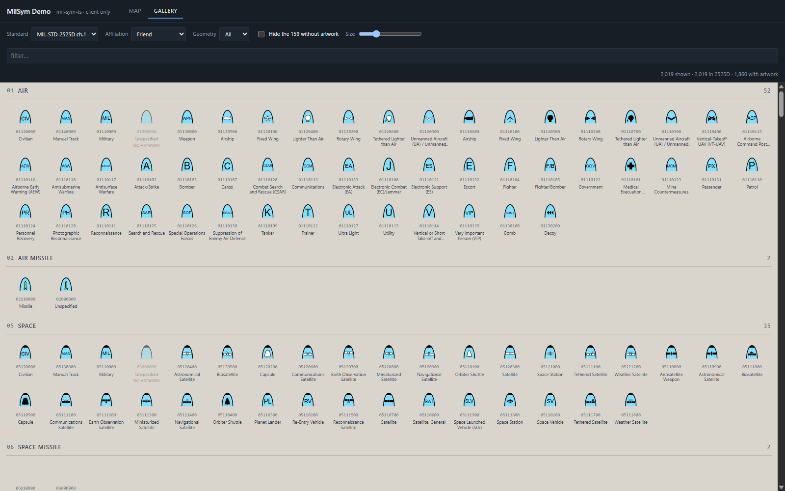
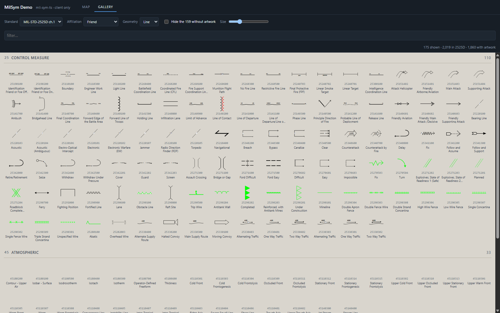
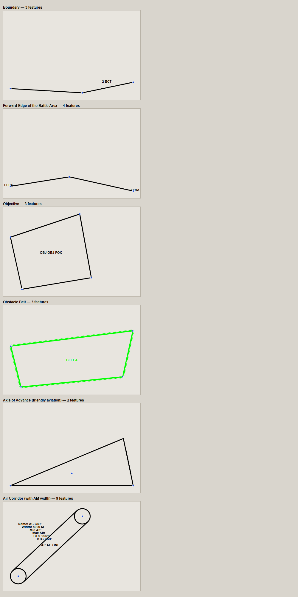
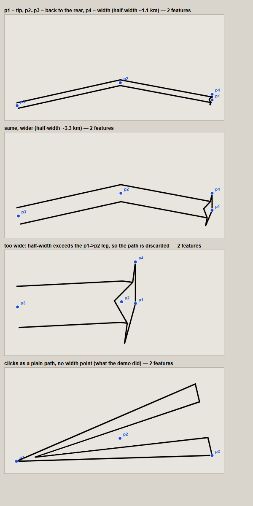
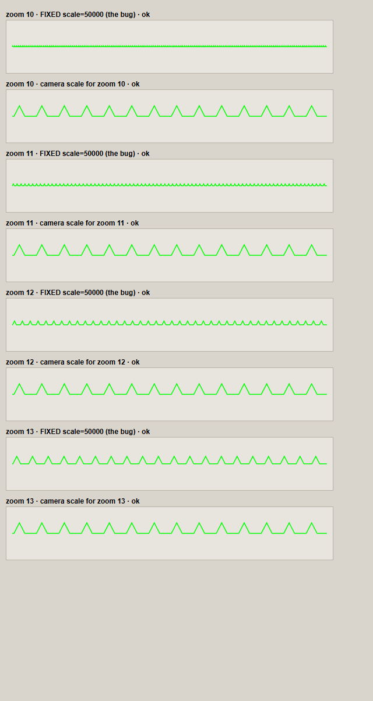

# sip-milsym-demo

**What it is for:** counting how many symbols [**mil-sym-ts**](https://github.com/missioncommand/mil-sym-ts)
(the US Army C5ISR renderer, MIL-STD-2525D/E and APP-6(D)/(E)) actually carries, and
comparing that against **map.army**, which draws 2525C through `milsymbol`. Every number
is measured from the renderer's own lookup tables in a real browser — nothing is quoted
from documentation, including map.army's side, which is read out of its generated catalog
and cited.

It draws symbols on a map as well, laid out along `sip-map-army`'s own drawing system, so
the coverage claims can be checked by hand: search for a symbol, place it, letter it.

```bash
npm install
npm run dev            # http://localhost:5173  (add ?rail=coverage for the comparison)
npm run smoke          # 45 checks in a headless browser (dev server must be up)
```



---

## The answer

**Like-for-like, mil-sym-ts carries 1.67× what map.army does** — 1,517 warfighting icon
parts in 2525D against 911 in map.army.

But the first number anyone gets by comparing the two catalogs is the *other* one, and it
points the other way:

| basis | mil-sym-ts (2525D) | map.army (2525C) | |
| --- | --- | --- | --- |
| Base entities, warfighting-equivalent | 878 | — | |
| …less the category nodes with no artwork | **842** | **911** | **0.92×** |
| **+ sector-modifier icons** | **1,517** | **911** | **1.67×** |
| Every symbol set the tables hold | 2,019 | — | different scope |
| All four standards together | 2,256 | — | different scope |

Both sides subtract their category nodes. map.army excludes 16 structural keys — "Air",
"Ground", "Unit" — that render as a bare frame; mil-sym-ts has the same kind of row and
**159** of them in 2525D, of which 115 return nothing at all from `RenderSVG`. Counting
all 878 against their 911 *drawable* keys was generous to this side, so it is not done
that way.

### Why the first row is unsound

2525C puts a symbol's whole specificity in **one function id**, so *Infantry*, *Infantry
Airborne* and *Infantry Mountain* are three separate rows of milsymbol's icon-part tables
— and map.army's 927 is a count of those rows.

2525D splits the same information in two: the **entity** at digits 11-16 and up to two
**sector modifiers** at digits 17-20, drawn inside the frame above and below the icon. So
those same three symbols are *one* `MSLookup` row plus two `SVGLookup` modifier icons.

Counting `MSLookup` rows against milsymbol's icon-part keys therefore counts one library's
entities against the other's entities **and** variants. Both numbers are real; the
comparison is not. Adding the modifier icons is what makes it one.

The modifier ids were verified rather than assumed: `SVGLookup`'s five-character keys are
`symbol set + modifier code + sector`, which is exactly what `SymbolID.getMod1ID` and
`getMod2ID` return for a composed SIDC (modifier 1 = 65 on a land unit → `10651`;
modifier 2 = 65 → `10652`, both present as keys). See `src/symbology/coverage.ts`.

### Neither figure is "pictures that can be drawn"

That is entities × modifier 1 × modifier 2 × 7 affiliations × 6 statuses × 8
HQ/task-force/dummy values × 28 echelon-or-mobility values. It is a large number and it
says nothing. Base symbols and icon parts are the two bases both libraries can be counted
on the same way.

## The measured numbers

### map.army — the baseline

| | |
| --- | --- |
| Standard | MIL-STD-2525C |
| Renderer | milsymbol 3.0.4 |
| Coding scheme | `S` (warfighting) |
| Catalog nodes | 927 |
| …of which structural | −16 (tree joints — "Air", "Ground", "Unit" — that render as a bare frame) |
| **Drawable symbols** | **911** |

Read from `sip-map-army/packages/symbols/src/generated/warfighting.ts` —
`WARFIGHTING_COUNT` and `WARFIGHTING_STRUCTURAL`. Copied as constants rather than
imported, because this is a separate project with no dependency on that repo, and stated
with its source so it can be re-checked when that catalog is regenerated.

### mil-sym-ts — per standard

| standard | version | entities | no artwork | wf drawable | + modifiers | **icon parts** | point |
| --- | --- | --- | --- | --- | --- | --- | --- |
| MIL-STD-2525D ch.1 | 11 | 2,019 | 159 | 842 | 675 | **1,517** | 1,604 |
| MIL-STD-2525E ch.1 | 15 | 2,060 `+2` | 183 | 847 | 799 | **1,646** | 1,626 |
| NATO APP-6(D) | 10 | 1,866 | 131 | 860 | 766 | **1,626** | 1,529 |
| NATO APP-6(E) ch.2 | 16 | 1,603 `+3` | 112 | 811 | 805 | **1,616** | 1,291 |

`+n` marks rows the lookup tables repeat **verbatim** — `getIDList` returns `25132200`
and `10000000` twice under 2525E, plus `25141200` under APP-6(E), with byte-identical
names and paths. Carried rather than hidden, so these totals reconcile with counting
`getIDList` by hand.

### All four together

| | |
| --- | --- |
| Distinct base symbols | **2,256** |
| Warfighting-equivalent | 1,033 |
| By geometry | 1,786 point · 205 line · 265 area |
| Symbol sets | 24 |
| In all four standards | 1,399 |
| In exactly one | 2525D 23 · 2525E 35 · APP-6(D) 11 · APP-6(E) 65 |

Only point symbols can be placed in this demo; line and area control measures need
`WebRenderer` and a geometry, which is a second drawing path.

### The scope caveat, stated once

The "warfighting-equivalent" column excludes five symbol sets that 2525C puts in other
coding schemes, because map.army's baseline covers scheme `S` only:

| set | | why excluded |
| --- | --- | --- |
| 25 | Control Measure (657) | 2525C scheme `G` — tactical graphics |
| 40 | Activities (154) | 2525C scheme `O` — MOOTW |
| 45 | Atmospheric (205) | 2525C scheme `W` — weather |
| 46 | Oceanographic (206) | 2525C scheme `W` |
| 47 | Meteorological Space (1) | 2525C scheme `W` |

SIGINT is a judgement call: 2525C gives it its own scheme `I`, 2525D folds it into sets
50-54 which behave like every other warfighting set. It is 25 entities either way, so
nothing turns on it — it is counted in, and said so.

## Every symbol, drawn

`?view=gallery` draws the whole catalog — **all 2,019 entities of 2525D**, or any of the
other three standards — grouped by symbol set, each cell labelled with its eight-digit
id so a row can be found on both sides of a comparison. No result cap, no
point-symbols-only filter.



- **Line and area symbols are in it too**, and this is the part worth putting next to
  map.army: 175 lines and 240 areas in 2525D, with the standard's own artwork — Boundary,
  Phase Line, Forward Edge of the Battle Area, Line of Departure, Ambush, Counterattack,
  fences and concertina wire, weather fronts. `MilStdIconRenderer` draws these as
  **preview icons** (the library's own words: "for multi-point graphics, modifiers are
  ignored because we don't need that information to show preview icons in the
  SymbolPicker"), so a phase line appears as a picker glyph, not as a boundary stretched
  across a map — that needs `WebRenderer` and a geometry, which is a drawing path this
  demo does not implement.

  
- **The rows with no artwork are marked, not hidden** — 159 of them in 2525D, tagged
  `no artwork`, with a checkbox to hide them. These are branch headers: "Air /
  Unspecified", "Atmospheric / Pressure Systems", "Control Measure / Command and Control
  Lines". 115 return nothing at all from `RenderSVG`; the rest draw the frame with no icon
  in it. They are exactly what map.army's 16 structural nodes are, and both sides subtract
  them.
- **Affiliation, geometry, size and a filter** are on the bar. Changing the affiliation
  re-renders every visible cell, which is the honest cost of showing what the renderer
  actually draws rather than a sprite sheet.
- Cells render as they scroll within 600px of the viewport, through **one**
  `IntersectionObserver` for the whole grid, and never re-render — `renderSymbol`
  memoises, so scrolling back up costs a map lookup.

Shareable URLs, for sending someone a specific corner of a specific standard:

```
?view=gallery                          every symbol in 2525D
?view=gallery&std=APP6E                every symbol in APP-6(E) ch.2
?view=gallery&geom=line                the 175 line symbols
?view=gallery&std=2525E&q=cyber        Cyberspace, which has no 2525C equivalent at all
?rail=coverage                         the comparison panel
?sample                                the map with a five-mark laydown
```

## Drawing tactical graphics on the map

**Yes — and it is the renderer's geometry, not an approximation.** `WebRenderer.RenderSymbol`
with `OUTPUT_FORMAT_GEOJSON` takes a SIDC and a list of `lng,lat` control points and
returns a styled `FeatureCollection` in real coordinates. All **415** line and area
entities of 2525D render; not one is refused once it has the modifiers it asks for.



And the anchor-point rule getting it wrong, then right:



Pick a line or area symbol in the browser and the map switches to the drawing tool: click
to add vertices, double-click to finish, `Esc` to cancel. The hint bar reads the required
point count out of the renderer's own tables — `MSInfo.getMinPointCount()` — and shows
the standard's **anchor point rule**, because for many graphics the clicks are not a path.
See *Where the drawing logic comes from* below: getting that wrong drew Main Attack as a
hairline wedge.

What comes back per graphic is a handful of features: `MultiLineString` and `Polygon` for
the drawing, each carrying `strokeColor`, `strokeWidth`, `fillColor`, `fillOpacity` and
sometimes `strokeDasharray`; and `Point` features for the lettering, carrying the text, a
font, an outline and pixel offsets. Measured across all 415, not read off a document. An
obstacle belt's teeth, an axis of advance's taper, a forward line of troops' half-circles
and an air corridor's end circles are all **computed by the renderer** — this project
supplies the clicks and nothing else.

### How it reaches MapLibre

- **The camera's scale, re-rendered on `zoomend`.** See below — a fixed scale draws every
  decorated line at the wrong size.
- **One GeoJSON source, rebuilt on change.** A source has no drag gesture to protect, so
  `setData` with the whole collection is simpler and faster than diffing features —
  `renderGraphic` memoises, so an unchanged graphic costs a map lookup rather than twelve
  kilobytes of trigonometry.
- **Fill and line layers driven by the feature properties**, so every colour and width is
  the renderer's. One approximation, and only one: MapLibre's `line-dasharray` is a paint
  constant and cannot take a data expression, so dashed graphics go to a second layer with
  a single dash pattern. Their colour, width and geometry are exact; the dash rhythm of a
  particular graphic may not be.
- **The lettering is HTML markers, not a `symbol` layer.** A symbol layer needs a glyph
  source — a font server — which the offline basemap does not have, so text would work on
  the hosted style and silently vanish on the other. The label features already carry
  their font and offsets.
- **`fillPattern` and `image`** appear on 27 features across the catalog and are not
  implemented: MapLibre needs a registered image for those. They fall back to a plain
  fill.

## Where the drawing logic comes from — and the bug in what I fed it

**All of the geometry is the library's.** Nothing in this project computes a shape. What
it supplies to `WebRenderer.RenderSymbol` is five things: the control points, **their
order**, `altitudeMode`, `scale`, and an empty `bbox`. So when a Main Attack came out as
a hairline wedge fanning across the map, the fault was in the order — and it was.

### What the standard actually says

`MSInfo.getDrawRule()` returns a rule per entity — Main Attack is `AXIS2` — and the
library's declarations carry each rule's anchor-point definition in the standard's own
words:

> **AXIS2** — "The symbol requires N anchor points, where N is between 3 and 50. **Point 1
> defines the tip of the arrowhead.** Point N-1 defines the rear of the symbol. Point N
> defines the back of the arrowhead. … Points 1 through N-1 determine the symbol's center
> line and **Point N determines the width.**"

So the clicks are **not a path**. Point 1 is the tip, the centre line runs *backwards*
from it, and the last point is a width control point. This demo collected clicks as a
tail-to-tip path and passed them straight through, so every axis graphic was drawn
backwards with its final click eaten as a width.

### And a trap that is only in the source

Reading `clsUtility.FilterAXADPoints` in the bundle:

```js
let pt0 = tg.Pixels[0];                            // the arrowhead tip
let controlPt = tg.Pixels[tg.Pixels.length - 1];   // the width control point
let relativeDist = CalcDistanceDouble(PointRelativeToLine(pt0, pt1, pt0, controlPt), controlPt) + 5;
if (relativeDist > CalcDistanceDouble(pt0, pt1)) {
  // …replaces pt1 with an extension along pt0→pt1 and DROPS every middle point
}
```

When the half-width exceeds the first leg of the centre line, the renderer **silently
discards the path** and draws a stub extended along leg one. It does not refuse and it
does not log. Every degenerate arrow then shares an origin — which is exactly what a
screen full of them looks like: a fan of hairline wedges from one point.

That threshold has a `+ 5` in **pixels** inside a geographic calculation, so a graphic
near the boundary can flip with the scale the renderer was handed.

### Measured, then fixed

| clicks | drawn centre line strays from the clicked points by |
| --- | --- |
| tip first, width point last | **554 m** (against a 1,093 m half-width — it hugs the path) |
| tail first, as a plain path | **13,635 m** |

The stray is bounded by the width rather than zero because what comes back is the two
*edges* of the corridor, not its centre line.

Three things changed:

1. **The rule is on every catalog entry** — `drawRule` and `drawRuleName`, from
   `MSInfo.getDrawRule()` and `DrawRules`' constants.
2. **The rule's text is generated into the demo** — `scripts/gen-draw-rules.mjs` extracts
   all 89 rules (87 with anchor-point text) from the library's declarations, quoted
   verbatim. The draw-hint bar shows the rule while the operator clicks, so the order is
   on screen rather than guessed. For the two axis rules — the ones whose order was
   measured — each click is labelled: *tip of the arrowhead*, *centre line running back
   from the tip*, *width, offset perpendicular from the tip*.
3. **The collapse condition is checked live.** `axisWidthCheck` computes the half-width and
   the first leg, and the bar warns before the shape is committed rather than leaving a
   wrong picture on the map.

Locked with four checks: the rule is on the entry, the centre line follows the clicks when
the tip is first and does not when it is not, the width is the perpendicular distance to
leg one, and an over-wide axis is caught.

### The scale was hardcoded, and decorated lines paid for it

`WebRenderer` generates a decorated line's ornament — the Xs of an obstacle line, the
teeth of a belt — at a density derived from the `scale` it is given, **in pixels**, before
converting to geography. Measured on the same two-point obstacle line:

| `scale` | coordinates returned |
| --- | --- |
| 5,000 | 4,931 |
| 50,000 | 494 |
| 500,000 | 50 |

This demo passed a constant `50000`, with a comment claiming that a graphic which changed
with the zoom "would be a different graphic at every zoom level". That was wrong. The
*geometry* is the same graphic at every zoom; only the ornament's step is a screen
quantity, which is exactly why the renderer asks for a scale. With one baked in, the
pattern grows with the ground as you zoom instead of staying put on the screen.



Every second row uses the camera's own scale and the teeth are **the same size on screen
at every zoom**. Every first row is the bug.

`scaleForCamera(zoom, latitude)` converts MapLibre's ground-metres-per-pixel into the
cartographer's ratio the renderer wants — `156543.03392 · cos(lat) / 2^zoom · 96/0.0254`
— and `MapView` pushes it into the store on `zoomend` and `moveend`. Not on `zoom`: an
obstacle line at a close zoom is tens of thousands of coordinates, and recomputing that
per frame of a pinch would drop the gesture, so the ornament stretches during the zoom and
snaps at the end.

Arrows are unaffected — an arrowhead is proportional to its own line, and
`25140602` returns the same geometry from 1:5,000 to 1:5,000,000. Only the decorated
graphics needed this.

### Two clicks and an arrow

The catalog holds two graphics that both read as a main attack, drawn under different
rules — and picking by name gets whichever the search ranked first:

| entity | name | rule | clicks |
| --- | --- | --- | --- |
| `25151403` | Axis of Advance / **Main Attack** | `AXIS2` | 4 (path + a width point) |
| `25140602` | Direction of Attack / **Friendly Main Attack (Decisive)** | `LINE1` | **2** |

`25140602` is the two-click arrow: click a start and an end, and the renderer returns the
arrow with its head at the second point. Scale-independent, no width point, no anchor-rule
trap. Both are now in the sample laydown, and every multipoint tile in the browser prints
its **rule and point count** so the choice is visible before the first click rather than
after the shape comes out wrong.

### What this says about the other 65 rules

67 distinct anchor-point rules apply across 2525D's 415 line and area entities. `AREA*`
and most `LINE*` rules really are "click the shape" — a boundary, an objective and an
obstacle belt were all correct from the start. `AXIS*`, `CORRIDOR*`, `RECTANGULAR*`,
`CIRCULAR*`, `ARC*` and `ELLIPSE*` are not: their points are ends, widths, radii and
azimuths. **Only the two axis rules have been measured here**; the rest show the
standard's text and pass the clicks through in order, which is right where the rule is a
path and unverified where it is not. A rule-by-rule tool is the honest next step, and it
is not in this demo.

Worth noting about the comparison: map.army draws Main Attack as **a plain line through
the clicked points with a label**, because milsymbol has no artwork for this family at
all. That is why its picture always follows the clicks — there is no anchor-point rule to
get wrong. Standard artwork costs an input convention.

### The refusal is a state, not an error

54 of the 415 cannot be drawn until a modifier gives them a size — an air corridor has no
width until Field AM says so. The renderer answers with
`{"type":"error","error":"… requires a modifiers object that has 1 distance/AM value."}`,
which `renderGraphic` parses into a `needs` field, so the panel shows the message and
highlights the input being asked for. Type `4000` into it and the corridor draws: tube,
end circles, `Width: 4000 M`. The sample laydown includes one deliberately without its
width, so that state has something behind it.

### One bug, and it was silent

`AM_DISTANCE` was not in `AMPLIFIER_KEYS` — that list is the vocabulary of a *point*
symbol, the fields lettered around a frame, and nothing lettered around a frame is a
distance. `amplifierMapOf` iterates it, so the value was **filtered out between the panel
and the renderer**: the operator typed a width, and the renderer went on refusing the
graphic with a message asking for exactly the number that had just been typed. Nothing
threw and nothing logged. Fixed with `GRAPHIC_AMPLIFIER_KEYS` and a check that the
corridor refuses bare and draws with the field set.

### What headless could not confirm

The screenshot above is the renderer's GeoJSON re-projected into inline SVG by
`scripts/` — not how the app draws it. Headless Chrome will not run MapLibre's render
loop here: the canvas paints the style's background and nothing else, so vector tiles and
GeoJSON layers are both invisible in a screenshot while the DOM markers show. What *was*
verified in the browser is that the collection reaches the source (`serialize()` returns
the features, the worker emits `metadata` and `content`) and that the layers are created.
**Open it in a real browser to see the layers paint** — `npm run dev`, then Sample
laydown.

## Which symbols actually differ

Counts are one thing; the useful question is *which* symbols one side has and the other
does not. The renderer ships `C2DLookup.getDCode` — the standard's own 2525C→2525D
migration table — so this is a real crosswalk, not a name match. All 911 of map.army's
drawable keys were put through it:

| | |
| --- | --- |
| Mapped to a 2525D entity | **722** — onto just **408** distinct entities (**1.77** 2525C keys each) |
| Mapped, entity not in `MSLookup` | 7 |
| No successor in the table | **182** |
| …but found in 2525D by name | **178** |
| …nothing found either way | **4** (Processing Facility, Node Centre, Telephone Switch, Sea Minelike) |

**map.army has essentially no symbol this cannot draw.** The 182 are gaps in the
*migration table*, not in 2525D — the table never maps into Land Installations at all,
though 2525D plainly holds `20121301 Airport/Air Base`, which is the key that made this
worth checking. Twenty were verified by hand and seventeen had an obvious 2525D
equivalent: Postal, Liaison, Iceberg, Hovercraft, Electric Power, Ammunition Ship,
Submarine Tender and ten more. The name column is labelled as weaker evidence everywhere
it appears, because a text match can agree by coincidence and can miss a rename.

That **1.77** is the coverage argument, measured a second and independent way: 2525C
spends nearly two function ids where 2525D spends one entity plus sector modifiers.
Twenty-three separate 2525C keys land on the single 2525D unmanned-aircraft entity;
twenty-two land on Army Aviation.

### The other direction — and it is not close

milsymbol draws 1,324 icon-part keys in total, and **thirteen** of them are tactical
graphics: one bridge and twelve stability-operations incident points. Not one boundary,
phase line, fortification, obstacle or minefield. That is not a gap in map.army — it is a
property of the renderer it draws with, and `packages/symbols/src/graphics.ts` says so in
its own words: *"the renderer this repository draws with does not draw tactical graphics
as a family"*.

map.army answers that with a **hand-authored table of 21 graphics** — a name and an
abbreviation attached to geometry the operator draws themselves, so a phase line is a
plain line labelled `PL`. The meaning is carried in the document; the artwork is not the
standard's.

mil-sym-ts carries **657 control-measure entities with the standard's own artwork**. So
the real coverage difference runs the other way, and it is whole families of symbology
rather than a few rows:

| | mil-sym-ts | map.army |
| --- | --- | --- |
| Control measures / tactical graphics | **657**, drawn to standard | 21, hand-authored labels on operator geometry |
| Weather — atmospheric + oceanographic + met space | **412** | — |
| Activities / MOOTW | **154** | — |
| Cyberspace (new in 2525E) | **77** | — (does not exist in 2525C) |
| Warfighting entities | 878 | **911** |

What map.army has that this does not is **not symbols**: it is the finding and naming
layers — a reviewed Thai alias table with a cited source per term, Thai labels per name
segment, RTA unit presets, a curated 105, and an embedding index for assisted search.

## Where to get the symbology, free

Everything this comparison rests on is free, and the libraries are permissively licensed.
Verified from the packages themselves, not from memory:

| what | licence / access |
| --- | --- |
| `@armyc2.c5isr.renderer/mil-sym-ts-web` — 2525D/E + APP-6(D)/(E) artwork and tables | **Apache-2.0**, npm |
| `milsymbol` — 2525C/B | **MIT**, npm |
| `mil-std-2525`, `milstandard-e` — JSON symbol tables | **MIT**, npm |
| MIL-STD-2525D / 2525E, the documents | Free from DoD **ASSIST QuickSearch**, no account: <https://quicksearch.dla.mil/qsSearch.aspx> |
| NATO APP-6(D)/(E), the documents | NATO charges no fee for standardization documents; via the NATO Standardization Document Database or a national standardization authority |

The practical upshot: the artwork does not have to be bought or drawn. mil-sym-ts is one
Apache-2.0 npm install and it carries the tables for four standards inline — which is why
this demo runs with no server behind it.

## Search

Coverage that cannot be found is indistinguishable from coverage that is not there, so
the search matters to the comparison. It was substring-only at first and made the catalog
look far thinner than it is:

| query | before | now |
| --- | --- | --- |
| `tank` | Tanker, Tanking, Antitank Obstacles | **Tank**, Tank Recovery Vehicle, … |
| `hq` | Earthquake Epicenter (1 hit) | **Named Headquarters**, … (5) |
| `sam` | nothing at all | **Air Defense Missile Launcher**, … (12) |
| `apc` | Armored, Armored, Carrier (28) | **Armored Personnel Carrier**, … (3) |
| `ifv` | 131 hits, mostly noise | **Infantry Fighting Vehicle** (1) |

Three mechanisms, English only — map.army has the same idea and much more of it, with a
Thai alias table carrying a cited source per term and a lexicon that reads the affiliation
and echelon out of the query:

- **Ranking**, so an exact name beats a word-prefix beats a substring, and the name beats
  the path. A substring only counts from four characters, or `hq` lands inside
  "Eart*hq*uake".
- **Initialisms**, so a query can be the acronym the standard did not print: "Air Defense
  Missile Launcher" indexes `adml`, "Chemical Plant" indexes `cp`.
- **A small abbreviation table**, matched *in addition* to what was typed, never instead.
  A multi-word expansion is a **phrase** and scores its weakest part: scoring the
  strongest instead was the first attempt and returned 150 rows for `sam` — anything
  mentioning "air".

## Drawing, and what the port proved

`sip-map-army` draws 2525C through three layers; this demo keeps them and swaps the
renderer:

| `sip-map-army` | here | |
| --- | --- | --- |
| `@map-army/symbols` | `src/symbology/catalog.ts` | the renderer's own tables — nothing generated |
| `@map-army/symbology` | `src/symbology/` | `renderSymbol`, same contract, new engine |
| `features/milx/map/useMilxMarkers` | `src/map/` | `markerOffset` **verbatim**, reconciler ported |

`renderSymbol` keeps its signature, its returned box and its memo; `markerOffset` is
copied across character for character and is correct against the new renderer's anchors;
the reconciler needed one import changed. Every difference that showed up is a difference
between the two *libraries*:

- **mil-sym-ts letters its own amplifiers and grows the image to fit.**
  `@map-army/symbology` keeps `SELF_LETTERED_AMPLIFIER_KEYS` — two fields it draws by
  hand because milsymbol clips Field AH at about four characters and prints Field C on
  top of the echelon marker for all fourteen echelons. No counterpart here, and none for
  `amplifierPlacement.ts` either: with no text outside the SVG there is nothing to place.
- **`MSInfo.getModifiers()` answers per symbol** which amplifiers apply — 24 for an
  infantry unit, 14 for an aircraft — so the panel offers the fields the standard gives
  this symbol and marks the rest. A generated table had nothing to ask.
- **It is browser-only, and it fails quietly.** mil-sym-ts measures text with a canvas.
  Under Node it logs `document is not defined` at INFO, swallows its own exception, and
  returns *a symbol anyway* — bare frame, no staff, no echelon, no lettering, same box,
  same anchor, nothing thrown. That is why the checks are a page driven by a headless
  browser and not a Node test.

### What the demo does

Pick a symbol from the live catalog of any of the four standards; place it by clicking the
map; drag the selected mark; edit the five frame fields and the 24 text amplifiers on the
draft or on a placed mark, watching the twenty digits change. **Anchor overlay** draws the
renderer's reported image bounds and the point inside them the symbol belongs to — make a
symbol a headquarters and the box grows downward while the anchor stays at the foot of the
staff, which is what `markerOffset` corrects. Pitch the map and each mark lifts off its
point with a leader line back down. **Sample laydown** (or `?sample`) puts down five marks
covering a staffed HQ with lettering, an echelon, equipment with a quantity and ENY, a
planned frame, and digits 9-10 carrying mobility rather than an echelon.

## Bugs found by running the checks

All four were invisible without them:

1. **`composeSidc` put the symbol set and entity in the wrong digits.** `MSLookup` keys
   its tables by an eight-character id whose halves are *not adjacent* in a SIDC — set at
   5-6, entity at 11-16. Padding the id to twenty digits produced a **valid, renderable**
   code, so every tile drew a plausible bare frame of the right affiliation and nothing
   looked broken.
2. **`Version_APP6Dch2` (12) has ids but no entity records.** `getIDList` returns all
   2,019 and `getMSLInfo` then returns nothing for every one, so the APP-6(D) catalog came
   out empty while every call looked like it succeeded. `Version_APP6D` (10) is populated.
   A gap in the library, measured rather than read off the types.
3. **The marker layer was gated on the map's `load` event.** `sip-map-army` has to wait —
   it adds sources and layers. This demo adds none; its marks are DOM elements over the
   canvas. Gated on `load`, slow or unreachable tiles meant no marks at all. Found by
   photographing the app in a headless browser.
4. **`scripts/` was outside `tsconfig`**, so the check script itself was never
   typechecked — and was carrying a duplicate `const`. Now included.

`MSInfo.getPath()` also returns a `" / "`-separated hierarchy that does **not** include
the entity's own name, which the search had to be corrected for.

## Layout

```
src/
  symbology/         DOM-free (but browser-only): no React, no store, no window
    renderer.ts      waking mil-sym-ts up, once
    catalog.ts       MSLookup -> searchable, ranked entries; per-symbol amplifier lists
    coverage.ts      the comparison: counts, the map.army baseline, the scope argument
    crosswalk.ts     C2DLookup: which symbols each side has, symbol by symbol
    data/            generated: the map.army fixture, and the 89 anchor-point rules
    sidc.ts          the standards, the field vocabularies, compose/parse
    amplifiers.ts    the text amplifiers, keyed by the renderer's own constants
    renderSymbol.ts  SIDC + amplifiers -> { svg, width, height, anchorX, anchorY }
    renderGraphic.ts SIDC + vertices -> styled GeoJSON (the multipoint path)
  map/
    markerOffset.ts  the anchor arithmetic (ported unchanged) and the camera scale
    useMilsymMarkers.ts  the reconciler: created once per id, then patched
    useGraphicOverlay.ts one GeoJSON source, fill/line layers, labels as markers
  state/
    useDemoStore.ts  marks, selection, draft. In memory; a reload loses them, on purpose
  components/        the browser, the gallery, the coverage report, the panel, the map
scripts/
  smoke-browser.ts   the 45 checks
  smoke.mjs          the driver
  gen-map-army-fixture.mjs  rebuilds the fixture from a sip-map-army checkout
  gen-draw-rules.mjs        extracts the 89 anchor-point rules from the library
```

## Known limits

- **`coverage.ts` reads two private statics.** `SVGLookup._SVGLookupD` and friends are
  the only way to *enumerate* the modifier tables; `getSVGLInfo(id, version)` answers for
  an id you already have. Guarded: if a future version renames them, the modifier count
  comes back zero and the panel says "unavailable" rather than reporting a wrong number.
  The APP-6 tables are deltas, so an APP-6 version's set is the union of its family's
  table and its own.
- **A reload loses the marks.** Deliberate: persisting to `localStorage` would be four
  lines and would show a document store that is not there.
- **Single-point icons only** on the map, as above.
- **The 8 MB bundle** is the renderer's lookup tables, compiled in. It is also why there
  is nothing to fetch at runtime.
- **The basemap's tiles were not verified in a headless browser.** MapLibre initialises
  and paints the style's background there, but vector tiles did not draw under software
  WebGL, so the screenshots show marks over an empty canvas. Check the basemap in a real
  browser.
- **No Thai.** English names straight out of the renderer, and an English-only search.
  map.army's Thai alias and label tables are a separate body of work with a cited source
  per row; a coverage proof does not need them.
